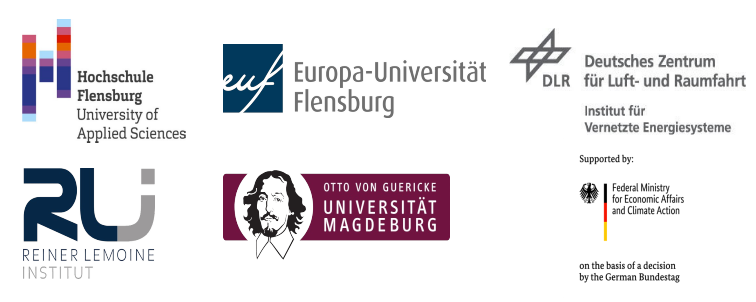

***************
About eGon-data
***************

Project background
==================

egon-data provides a transparent and reproducible open data-based data processing pipeline for generating data models suitable for energy system modeling. The data is customized for the requirements of the research project eGo_n. The research project aims to develop tools for open and cross-sectoral planning of transmission and distribution grids. For further information please visit the `eGo_n project website <https://ego-n.org/>`_.
egon-data is a further development of the `Data processing <https://github.com/openego/data_processing>`_ developed in the former research project `open_eGo <https://openegoproject.wordpress.com/>`_. It aims to extend the data models as well as improve the replicability and manageability of the data preparation and processing. 
The resulting data set serves as an input for the optimization tools `eTraGo <https://github.com/openego/eTraGo>`_, `ding0 <https://github.com/openego/ding0>`_ and `eDisGo <https://github.com/openego/eDisGo>`_ and delivers, for example, data on grid topologies, demands/demand curves and generation capacities in a high spatial resolution. The outputs of egon-data are published under open-source and open-data licenses.  

Objectives of the project
=========================

Driven by the expansion of renewable generation capacity and the progressing electrification of other energy sectors, the electrical grid increasingly faces new challenges: fluctuating supply of renewable energy and simultaneously a changing demand pattern caused by sector coupling. However, the integration of non-electric sectors such as gas, heat, and e-mobility enables more flexibility options. The eGo_n project aims to investigate the effects of sector coupling on the electrical grid and the benefits of new flexibility options. This requires the creation of a spatially and temporally highly resolved database for all sectors considered. 

Project consortium and funding
==================================

The following universities and research institutes were involved in the creation of eGon-data: 

* University of Applied Sciences Flensburg
* Reiner Lemoine Institut
* Otto von Guericke University Magdeburg
* DLR Institute of Networked Energy Systems
* Europa-Universität Flensburg 

The eGo_n project (FKZ: 03EI1002) is supported by the Federal Ministry for Economic Affairs and Climate Action (BMWK) on the basis of a decision by the German Bundestag.

eGon-data as one element of the eGo-Toolchain
=============================================

In the eGo_n project different tools were developed, which are in exchange with each other and have to serve the respective requirements on data scope, resolution, and format. The results of the data model creation have to be especially adapted to the requirements of the tools eTraGo and eDisGo for power grid optimization on different grid levels. 
A PostgreSQL database serves as an interface between the data model creation and the optimization tools.
The figure below visualizes the interdependencies between the different tools. 

Modeling concept and scenarios
===============================

eGon-data provides a data model suitable for calculations and optimizations with the tools eTraGo, eDisGo and eGo and therefore aims to satisfy all requirements regarding the scope and temporal as well as spatial granularity of the resulting data model.
The following image visualizes the different components considered in scenario ``eGon2035``.

  
eGon-data aims to create different scenarios, which differ in terms of RE penetration or the availability of flexibility options. Currently, the following scenarios are available or in progress. 

* ``eGon2035`` Mid-termin scenario based on assumptions from the German network expansion plan 'scenario C2035', version 2021 and TYNDP
* ``eGon2035_lowflex`` Mid-termin scenario similar to 'eGon2035', but with a limited availability of flexibility options
* ``eGon100RE`` Long-term scenario with a 100% RE penetration, based on optimization results with PyPSA-Eur-Sec and additional data inputs (work-in-progress)

.. list-table:: Installed capacities of German power park in scenario ``eGon2035``
   :widths: 50 50
   :header-rows: 1

   * - carrier
     - Installed capacities
   * - gas
     - 46.7 GW
   * - oil
     - 1.3 GW
   * - pumped hydro
     - 10.2 GW
   * - wind onshore
     - 90.9 GW
   * - wind offshore
     - 34.0 GW
   * - solar
     - 120.1 GW
   * - biomass
     - 8.7 GW
   * - others
     - 5.4 GW

.. list-table:: German energy demands in scenario ``eGon2035``
   :widths: 50 50
   :header-rows: 1

   * - Demand sector
     - Energy demand
   * - MIT transport
     - 41.4 TWh:sub:`el`
   * - central heat
     - 68.9 TWh:sub:`th`
   * - rural heat
     - 423.2 TWh:sub:`th`
   * - electricity
     - 498.1 TWh:sub:`el`
   * - CH:sub:`4` industry
     - 196.0 TWh:sub:`CH:sub:`4``
   * - H:sub:`2` industry
     - 16.1 TWh:sub:`H:sub:`2``
   * - H:sub:`2` transport
     - 26.5 TWh:sub:`H:sub:`2``
 

